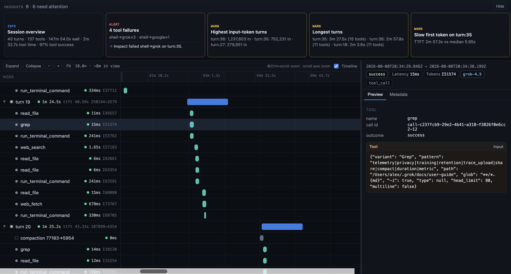

# Interstellar

**Ever finished a coding session and wondered what went wrong?**

We built **Interstellar** to help you understand why.

Run `/interstellar` to automatically analyze your session, recommend better tools and skills, propose harness updates, and validate the changes.

**One command to make your next session better.**



---

## Setup

```sh
git pull origin main
```

Open a fresh Grok session with this repo as the workspace so project skills (including `/interstellar`) reload.

---

## How it works

[Architecture (Excalidraw)](https://app.excalidraw.com/l/112hwLhjPUg/4UZ9EDqF6a2)

```text
  finished session
        │
        ▼
  normalize  ──►  canonical trace + timeline
        │
        ▼
  analyze    ──►  findings & recommendations
        │           (skills, tools, MCP, harness shape)
        ▼
  patch      ──►  bounded harness changes
        │           (skills, config, MCP, rules)
        ▼
  replay     ──►  same prompt, control vs treatment
        │
        ▼
  grade      ──►  efficiency meters + pairwise judge
        │
        ▼
  report     ──►  did the change actually help?
```

---

## Quick start

### In Grok

```text
/interstellar                 # current / latest session
/interstellar <session-id>    # specific session UUID
```

### Full review loop (CLI)

From the repo root (Python 3.12+, stdlib only — no pip install):

```sh
# Plan only — no model spend
python3 -m interstellar review traces/corpus/skill_bloat_*.json \
  --dry-run --use-cached-analysis

# Live cycle: analyze → patch → replay → grade → report
python3 -m interstellar review path/to/trace.json \
  --k 3 --max-patches 3 --out runs/my-run/ --serve
```

### Dashboard

Both views of a session live on **one loopback site, as two tabs**:

| Tab | What it shows |
|---|---|
| **Trace** | the session timeline — every tool, skill, MCP call and its duration, plus the rules-based insights strip |
| **Review** | what to change and whether it helped — patch diffs, before/after metrics, the acceptance verdict |

```sh
python3 -m interstellar.combined_serve runs/my-run/ \
  --trace-package hackathon/session-analysis/packages/<session-id>/ \
  --port 4242
```

Or from the visualizer launcher, which normalizes the session first:

```sh
hackathon/session-analysis/bin/interstellar-visualize <session-id> [--review-out DIR]
```

Either side may be omitted — pass only `--trace-package` to serve the timeline
alone, or only `out_dir` for the report alone. The missing tab says so plainly
rather than erroring. The header shows the session id both tabs are rendering,
and warns loudly if they disagree.

**Running the analysis from the page.** The Review tab has a **Re-run** button
with a `k` selector (3 / 5 / 10). It starts a full cycle — analyze, patch,
replay, grade — and reloads with the new recommendations when it finishes. A
cycle takes minutes and spends real API budget, so the button reports elapsed
time while it runs and surfaces the error if it fails.

`k` matters: the acceptance gate cannot accept anything below `k=5`, because at
k=3 no statistic can reach significance by construction (see
[docs/review-loop/methodology.md](docs/review-loop/methodology.md)). Use `k=10`
when you want a verdict rather than a direction.

Starting from a session with no report yet? Point the button at its normalized
trace and the first cycle can be launched from the page:

```sh
python3 -m interstellar.combined_serve runs/new-run/ \
  --trace-package hackathon/session-analysis/packages/<session-id>/ \
  --trace-file traces/corpus/<session>.json
```

The server binds `127.0.0.1` only, serves a fixed allow-list of files, and the
re-run endpoint accepts nothing from the request except a whitelisted `k` —
every other argument comes from server-side config.

---

<div align="center">

<h1>
  <picture>
    <source media="(prefers-color-scheme: dark)" srcset="https://media.x.ai/v1/website/spacexai-symbol-white-transparent-0c31957f.png">
    <source media="(prefers-color-scheme: light)" srcset="https://media.x.ai/v1/website/spacexai-symbol-black-transparent-6435cf42.png">
    
  </picture>
  <br>
  Grok Build (<code>grok</code>)
</h1>

**Grok Build** is SpaceXAI's terminal-based AI coding agent. It runs as a
full-screen TUI that understands your codebase, edits files, executes shell
commands, searches the web, and manages long-running tasks — interactively,
headlessly for scripting/CI, or embedded in editors via the Agent Client
Protocol (ACP).

[Installing the released binary](#installing-the-released-binary) ·
[Building from source](#building-from-source) ·
[Documentation](#documentation) ·
[Repository layout](#repository-layout) ·
[Development](#development) ·
[Contributing](#contributing) ·
[License](#license)


**Learn more about Grok Build at [x.ai/cli](https://x.ai/cli)**

This repository contains the Rust source for the `grok` CLI/TUI and its agent
runtime. It is synced periodically from the SpaceXAI monorepo.

A small `SOURCE_REV` file at the root records the full monorepo commit SHA
for the version of the code present in this tree.

</div>

---

## Installing the released binary

Prebuilt binaries are published for macOS, Linux, and Windows:

```sh
curl -fsSL https://x.ai/cli/install.sh | bash   # macOS / Linux / Git Bash
irm https://x.ai/cli/install.ps1 | iex          # Windows PowerShell
grok --version
```

See the [changelog](https://x.ai/build/changelog) for the latest fixes,
features, and improvements in each release.

## Building from source

Requirements:

- **Rust** — the toolchain is pinned by [`rust-toolchain.toml`](rust-toolchain.toml);
  `rustup` installs it automatically on first build.
- **[DotSlash](https://dotslash-cli.com)** — required so hermetic tools under
  [`bin/`](bin/) (notably [`bin/protoc`](bin/protoc)) can download and run.
  Install it and ensure `dotslash` is on your `PATH` **before** building:

  ```sh
  cargo install dotslash
  # or: prebuilt packages — https://dotslash-cli.com/docs/installation/
  /usr/bin/env dotslash --help   # sanity check
  ```

- **protoc** — proto codegen resolves [`bin/protoc`](bin/protoc) via DotSlash,
  or falls back to a `protoc` on `PATH` / `$PROTOC`.
- macOS and Linux are supported build hosts; Windows builds are best-effort
  and not currently tested from this tree.

```sh
cargo run -p xai-grok-pager-bin              # build + launch the TUI
cargo build -p xai-grok-pager-bin --release  # release binary: target/release/xai-grok-pager
cargo check -p xai-grok-pager-bin            # fast validation
```

The binary artifact is named `xai-grok-pager`; official installs ship it as
`grok`. On first launch it opens your browser to authenticate — see the
[authentication guide](crates/codegen/xai-grok-pager/docs/user-guide/02-authentication.md).

## Documentation

Full online documentation is available at
[docs.x.ai/build/overview](https://docs.x.ai/build/overview).

The user guide ships with the pager crate:
[`crates/codegen/xai-grok-pager/docs/user-guide/`](crates/codegen/xai-grok-pager/docs/user-guide/)
— getting started, keyboard shortcuts, slash commands, configuration, theming,
MCP servers, skills, plugins, hooks, headless mode, sandboxing, and more.

## Repository layout

| Path | Contents |
|------|----------|
| `interstellar/` | The review loop: harness snapshot, typed patches, sandboxed replay, graders, paired statistics, report + dashboard |
| `normalizer/` | Grok session store → the canonical `trace.json` every stage reads |
| `analyzer/` | The session auditor: deterministic digest → schema-constrained recommendations |
| `synth/` | Labelled synthetic corpus — real sessions with planted, documented defects, plus the coverage gate |
| `traces/corpus/` | The generated corpus and its answer key |
| `hackathon/session-analysis/` | The trace visualizer (timeline + insights) and its normalizer |
| `docs/review-loop/` | Statistical methodology and the branch review behind the loop's design |
| `crates/codegen/xai-grok-pager-bin` | Composition-root package; builds the `xai-grok-pager` binary |
| `crates/codegen/xai-grok-pager` | The TUI: scrollback, prompt, modals, rendering |
| `crates/codegen/xai-grok-shell` | Agent runtime + leader/stdio/headless entry points |
| `crates/codegen/xai-grok-tools` | Tool implementations (terminal, file edit, search, ...) |
| `crates/codegen/xai-grok-workspace` | Host filesystem, VCS, execution, checkpoints |
| `crates/codegen/...` | The rest of the CLI crate closure (config, MCP, markdown, sandbox, ...) |
| `crates/common/`, `crates/build/`, `prod/mc/` | Small shared leaf crates pulled in by the closure |
| `third_party/` | Vendored upstream source (Mermaid diagram stack) — see below |

> [!IMPORTANT]
> The root `Cargo.toml` (workspace members, dependency versions, lints,
> profiles) is **generated** — treat it as read-only. Prefer editing per-crate
> `Cargo.toml` files.

## Development

```sh
cargo check -p <crate>        # always target specific crates; full-workspace builds are slow
cargo test -p xai-grok-config # per-crate tests
cargo clippy -p <crate>       # lint config: clippy.toml at the repo root
cargo fmt --all               # rustfmt.toml at the repo root
```

## Contributing

> [!NOTE]
> External contributions are not accepted. See [`CONTRIBUTING.md`](CONTRIBUTING.md).

## License

First-party code in this repository is licensed under the **Apache License,
Version 2.0** — see [`LICENSE`](LICENSE).

Third-party and vendored code remains under its original licenses. See:

- [`THIRD-PARTY-NOTICES`](THIRD-PARTY-NOTICES) — crates.io / git dependencies,
  bundled UI themes, and **in-tree source ports** (including openai/codex and
  sst/opencode tool implementations)
- [`crates/codegen/xai-grok-tools/THIRD_PARTY_NOTICES.md`](crates/codegen/xai-grok-tools/THIRD_PARTY_NOTICES.md)
  — crate-local notice for the codex and opencode ports (license texts +
  Apache §4(b) change notice)
- [`third_party/NOTICE`](third_party/NOTICE) — vendored Mermaid-stack index
